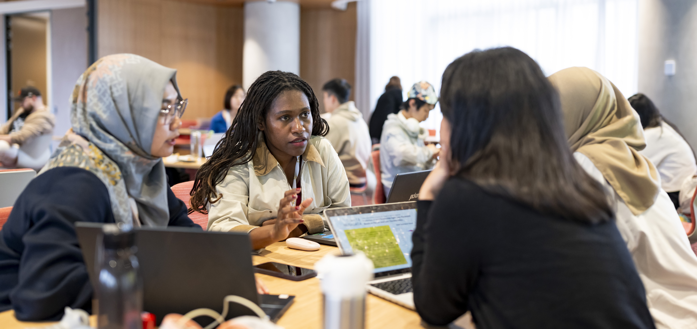
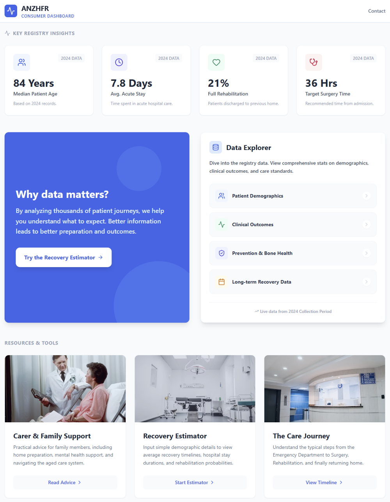
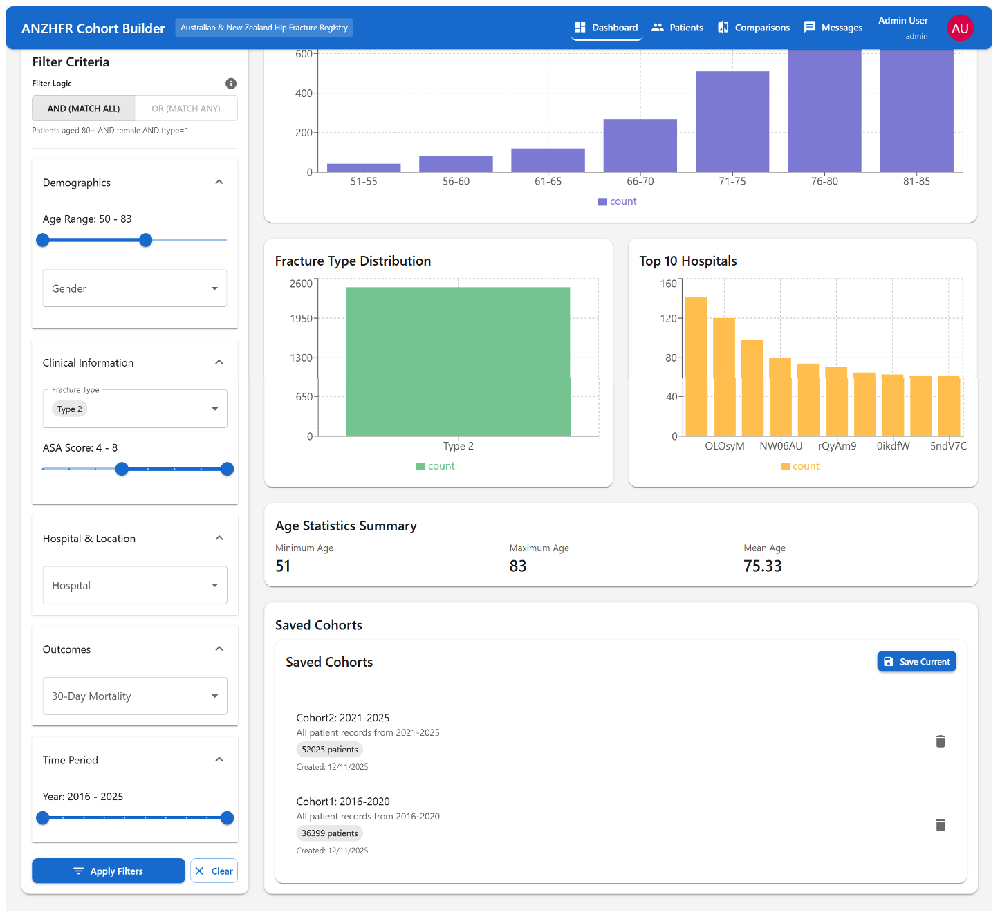
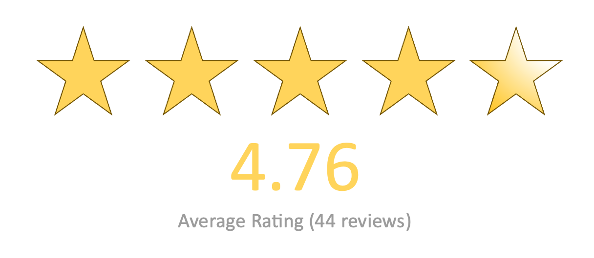

::: column-screen-inset

:::

## Key figures

<div style="font-size:1.2em;">

-   **70** Students 👩🏽‍🎓 from **14** different UNSW schools and research centres 🏫 

-   **18** Teams 🤝

-   **90,000+** Hip Fracture records 📈 
  
-   **Five** ANZHFR Clinical and Registry experts 👩🏼‍⚕️

-   **Two** Health Data Scientists from the Centre for Big Data Research in Health [organising the event](../organisers.qmd)

-   **One** winning team 🌟

</div>

## Overview of the event


The third UNSW Health Data Science Datathon brought together seventy UNSW students across eighteen teams on 11-12 December, 2025. Participants dived into the [Australian and New Zealand Hip Fracture Registry](2025-data.qmd) data, tackling one of four challenges: 

1. Clinical dashboard (Patient-facing or clinician-facing)
1. Cohort selector tool
1. Estimating causal effects
1. Predicting post-surgery outcomes


 </span>](../images/LoRes2025/Datathon2025_UNSW_Credit_CassandraHannagan-117.jpg)

Five clinical and registry data experts from the ANZHFR were on hand over the course of the event. They provided invaluable insights, answered questions, and offered feedback to help participants refine their research questions and to understand the tricky nature of clinical registry data.

 </span>](../images/LoRes2025/Datathon2025_UNSW_Credit_CassandraHannagan-136.jpg) 


Datathon participants also had the opportunity to work in the new [Digital Health Hub](https://www.unsw.edu.au/research/facilities-and-infrastructure/find-a-facility/restech#heading-1380014661), a purpose-built environment for exploring and presenting data at scale. 

 </span>](../images/LoRes2025/Datathon2025_UNSW_Credit_CassandraHannagan-84.jpg) 

On Day 2, finalist teams presented their work to a panel of judges. 

 </span>](../images/LoRes2025/Datathon2025_UNSW_Credit_CassandraHannagan-225.jpg)


## Announcing the winners

::: {.panel-tabset}

## 1st Place

### Joint Ventures

 </span>](../images/LoRes2025/Datathon2025_UNSW_Credit_CassandraHannagan-399.jpg)

#### Development of predictive models for patient outcomes.

_Can we predict if a patient will experience post-operative delirium, based on personal and pre-operative characteristics?_

**Approach:** Build machine learning models combine models with ensemble stacking, Bayesian hierarchical model, full-stack production application

**Results:** Ensemble stacking models able to predict post-operative delirium with 80% AUC. Identified causal relationship between top features with Bayesian network.

**Conclusion** Post-operative delirium is predictable from pre-operative characteristics. Production-ready web application enables real-time risk assessment for clinicians, improving patient outcomes.


## 2nd Place

### ICU Rizz

 </span>](../images/LoRes2025/Datathon2025_UNSW_Credit_CassandraHannagan-396.jpg)

#### Development of predictive models for patient outcomes.

**Approach:** We refined the dataset through strict cleaning, removing inconsistent records, selecting clinically relevant predictors, and applying logical imputations. This produced a high-quality, structured dataset ready for modelling 120-day functional walking recovery.

**Results:** The Random Forest model achieved 70% accuracy, performing strongly for recovered and declined classes. Severe-decline predictions remained challenging, reflecting class imbalance. Overall, the cleaned dataset enabled stable, clinically aligned predictive performance across major outcome groups.

**Conclusion** Despite difficulty predicting severe decline, key predictors behaved consistently, supporting future model refinement and stronger clinical collaboration to enhance patient outcome prediction.


## 3rd Place

### Satra

 </span>](../images/LoRes2025/Datathon2025_UNSW_Credit_CassandraHannagan-394.jpg)

#### Consumer dashboard

**Approach:** Total rebuild of ANZHFR landing page. Constructed an interactive consumer dashboard using React and Vite. Delivers critical information to carers and family.

Interactive Dashboard for advanced statistic view built using Streamlit.

Delirium Estimation tool utilising CatBoost algorithm.


**Results:** Deliver resources and statistics to a consumer audience. 
Operational interactive dashboard gives customizable insights
Delirium Predictor achieves AUC = 0.81, Recall = 0.73



## 4th Place

### Hip Injury Not Found

 </span>](../images/LoRes2025/Datathon2025_UNSW_Credit_CassandraHannagan-393.jpg)

#### ANZHFR Cohort Builder

**Approach:** Front-end is created using React for an interactive dashboard by sending API requests to the back-end (Python). Users input filter conditions to subset data. 

**Results:** A functioning cohort builder prototype that filters hip fracture data as specified by the user and presents key visualisations and summaries from this subset. These cohorts can then be saved and compared.

**Conclusion** This cohort builder allows for researchers to quickly check for sufficient data in specific cohorts and explore viability for future research by comparing specified patient groups. 




:::

Congratulations to all the participants! 

## What our participants said




::: {.grid}

::: {.g-col-6}

<div style="color:#78c2ad; font-style: italic; font-size: 1.2em; text-align: right; opacity: 0.6;">Based on your experience at the datathon, would you recommend it to other students?</div>

:::

::: {.g-col-1}

:::

::: {.g-col-5}
<div style="color:#78c2ad;">

<div style="font-size:4em; margin:-20px; padding:0px;">100%</div> <div style="font-size:1em; margin:0px">AGREE</div>

</div>

:::


:::
<br>

::: {.grid}

::: {.g-col-9}
> _I really enjoyed the overall learning experience, particularly the opportunity to work with real-world health data and apply data science concepts in a practical, collaborative setting. The mentoring and facilitation throughout the datathon were excellent. The organisers were attentive, approachable, and supportive, which created a welcoming environment for learning and experimentation. The structure of the event also encouraged problem-solving, teamwork, and critical thinking._

:::

::: {.g-col-3}

:::

:::


::: {.grid}

::: {.g-col-3}

:::

::: {.g-col-9}
> _I particularly enjoyed interacting with members of the ANZHFR team and receiving guidance from our professors. Additionally, I found it insightful to observe how participants from different departments approached problem-solving from diverse perspectives, and I appreciated the well-organized arrangements of the datathon._
:::

:::


::: {.grid}

::: {.g-col-1}

:::

::: {.g-col-8}
> _Food was amazing_

:::

::: {.g-col-2}

:::

:::

::: {.grid}

::: {.g-col-2}

:::

::: {.g-col-10}
> _I learn so many new things from my friends with a health background._
:::

:::


## Picture gallery

Explore the images from the day below. Credit for all images to [Cassandra Hannagan](https://www.cassandrahannagan.com/). 

::: {style="display: grid;grid-template-columns: repeat(auto-fill, minmax(120px, 1fr));grid-gap: .5em; inline-size: 100%;"}
```{r, results='asis', echo=FALSE, warning=FALSE, message=FALSE}
nPics <- length(list.files(here::here("images/LoRes2025")))

for (i in 1:nPics) {
  cat("{group='my-gallery'}\n\n", sep='')
}
```
:::
