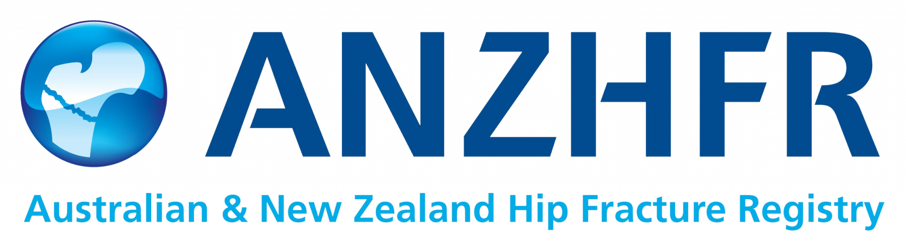

This year's datathon will use synthetic data from the Australian and New Zealand Hip Fracture Registry. This data resource can be used to address important health questions that will require you to develop statistical or machine learning models of patient outcomes, visualise patient data, or build front end applications to explore or summarise the data.  

## The Problem

::: {.quote-block}

The risk of falls and fractures increases with age. Each year, approximately **19,000 patients in Australia and 4,000 patients in New Zealand** present with a new hip fracture. These presentations are projected to increase in the foreseeable future, as are the associated costs to individual patients, their families, the community and the healthcare system.

:::

## The Registry

::: {.quote-block}

The Australian and New Zealand Hip Fracture Registry (ANZHFR) is a clinical quality registry that collects data about older people admitted to hospital with a broken hip in Australia and New Zealand. The registry is managed by a group clinicians and experts in the field with representation from a number of key professional organisations.

:::

## Purpose

::: {.quote-block}

The ANZHFR is designed to allow hospitals to audit the care they provide against key markers of safe, high quality care. The data can then be used to improve clinical performance, examine national trends, advocate for better clinical care and ultimately optimise patient outcomes

:::

_source: [anzhfr.org](https://anzhfr.org/)_
