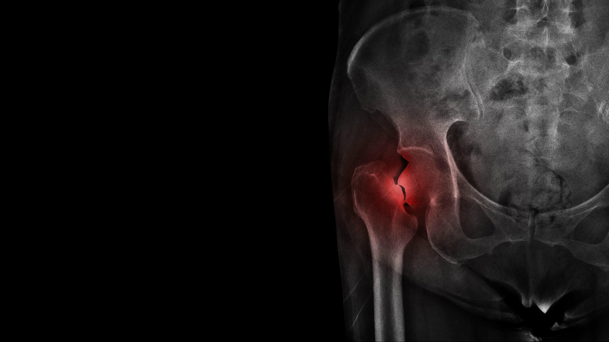

---
format:
  closeread-html:
    remove-header-space: true
    cr-style:
      narrative-text-color-overlay: "#a3a3a3"
      section-background-color: black
      narrative-background-color-overlay: transparent
      narrative-overlay-max-width: '60%'
      narrative-outer-margin: '1%'
    theme: [slate, custom.scss]
---


::: {.column-screen }

```{=html}

<div class="video-container">

  <video autoplay loop muted playsinline width="100%">
    <source src="images/AdobeStock_1634046525_trim3.mp4" type="video/mp4">
  </video>

  <div class="video-overlay">
    <h2>UNSW Health Data Science Datathon</h2>
    <p>Thursday 11 – Friday 12 December 2025</p>
    <div class="button-group">
      <a href="#details" class="info-button">
        <i class="bi bi-info-circle"></i> Details
      </a>
      <a href="registration.qmd" class="register-button">
        <i class="bi bi-person-plus"></i> Register
      </a>
    </div>
  </div>
  
  
  <div class="scroll-indicator">
    <span class="arrow"></span>
  </div>

</div>

```
:::


::::: {.cr-section layout="overlay-left"}
 
Each year, approximately 19,000 patients in Australia and 4,000 patients in New Zealand present with a new hip fracture @cr-image1

These presentations are expected to increase in the foreseeable future, as our populations age

When patients are admitted to hospital with a broken hip they are entered into the The Australian and New Zealand Hip Fracture Registry (ANZHFR)

The ANZHFR data can then be used to improve clinical performance, examine national trends, advocate for better clinical care and ultimately optimise patient outcomes

::: {#cr-image1}

:::

:::::


