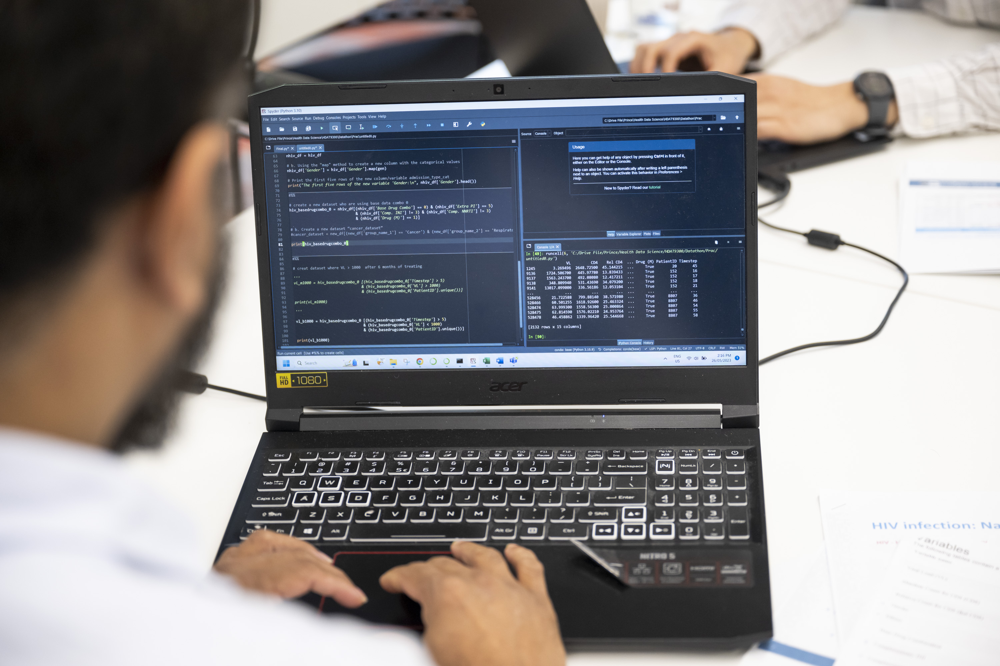

---
format:
  closeread-html:
    remove-header-space: true
    cr-style:
      narrative-text-color-overlay: "#a3a3a3"
      section-background-color: black
      narrative-background-color-overlay: transparent
      narrative-overlay-max-width: '60%'
      narrative-outer-margin: '1%'
    theme: [minty, custom.scss]
---


::: {.column-screen }

```{=html}

<div class="video-container">

  <video autoplay loop muted playsinline width="100%">
    <source src="images/AdobeStock_1634046525_trim3.mp4" type="video/mp4">
  </video>

  <div class="video-overlay">
    <h2>UNSW Health Data Science Datathon</h2>
    <p>Thursday 11 – Friday 12 December 2025</p>
    <div class="button-group">
      <a href="#the-unsw-health-data-science-datathon" class="info-button">
        <i class="bi bi-info-circle"></i> Details
      </a>
      <a href="registration.qmd" class="register-button">
        <i class="bi bi-person-plus"></i> Register
      </a>
    </div>
  </div>
  
  
  <div class="scroll-indicator">
    <span class="arrow"></span>
  </div>

</div>

```
:::


::::: {.cr-section layout="overlay-left"}

Each year, approximately 19,000 patients in Australia and 4,000 patients in New Zealand present with a new hip fracture @cr-image1

These presentations are expected to increase in the foreseeable future, as our populations age

When patients are admitted to hospital with a broken hip they are entered into the Australian and New Zealand Hip Fracture Registry (ANZHFR)

The ANZHFR data can then be used to improve clinical performance, examine national trends, advocate for better clinical care and ultimately optimise patient outcomes


::: {#cr-image1}

:::

:::::

:::::: {.column-screen}



::::::


## The UNSW Health Data Science Datathon

A two-day datathon where teams will work together to analyse real-world hip fracture data. Participants will develop a full data science pipeline with prizes awarded for the best submission. 

### Key Details

#### When is it? 
Thursday 11 - Friday 12 December 2025. Check out the [schedule](schedule.html) for more details

#### Where is it
[UNSW Health Translation Hub](https://www.unsw.edu.au/precincts/rhip/hth) located on the corner of High Street and Botany Street Randwick

### Who can participate?
* UNSW students interested in analysing health data.
* Enrol as a team of 4.

### What skills do I need?

The approach to the datathon challenge is open ended---you could be working on a sophisticated prediction model, a patient-facing dashboard, or data-cleaning pipeline. At a minimum, you (or someone on your team) should be able to read in a dataset and do some basic data cleaning and summarisation using any software package of your choice. Effective teams combine members with different skill sets: epidemiological thinking is just as important as coding and algorithms. You also need someone on your team who can present and communicate your approach to the judging panel.


### The data

Participants will analyse real-world data from the Australia, and New Zealand Hip Fracture Registry (ANZHFR). Check out the [data](data.html) page for more details. 


### Registration

Register online [here](rte.ie). All team members must register. 


### Contact

For questions, information or accessibility queries, please contact <a href="mailto:o.perezconcha@unsw.edu.au">Dr Oscar Perez Concha</a> from the Center for Big Data Research in Health, UNSW. Accessibility requirements can also be noted in the [registration form](https://forms.office.com/r/K2RQZeb1VF). 

::: {.oscar}

<h2>Menú del día</h2>

* Gambas Pil Pil
* Patatas Bravas
* Helados
:::


